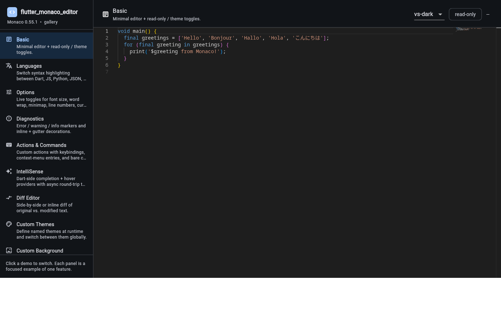

# flutter_monaco_editor

[](https://pub.dev/packages/flutter_monaco_editor)
[](https://pub.dev/packages/flutter_monaco_editor/score)
[](https://pub.dev/packages/flutter_monaco_editor)
[](LICENSE)
[](https://github.com/outr/flutter_monaco_editor/actions/workflows/ci.yml)

A complete Flutter wrapper for [Monaco Editor](https://github.com/microsoft/monaco-editor) (the editor that powers VS Code) with **full API parity** across Web, Android, iOS, macOS, Windows, and Linux.

## ▶ [Try the live demo →](https://outr.github.io/flutter_monaco_editor/)

No install required — the example gallery (9 demos covering every API surface) is deployed to GitHub Pages straight from this repo. Check out the editor, diff view, IntelliSense, custom themes, and the transparent-background showcase right in your browser.

[](https://outr.github.io/flutter_monaco_editor/)

## Status

**Early development.** Core API + most language features are in place. See [PLAN.md](PLAN.md) and [CHANGELOG.md](CHANGELOG.md).

## Installation

```yaml
dependencies:
  flutter_monaco_editor: ^0.5.0
```

No per-platform registration — one import, one widget:

```dart
import 'package:flutter_monaco_editor/flutter_monaco_editor.dart';

MonacoEditor(
  initialValue: 'void main() {}',
  language: 'dart',
)
```

## Platform support

| Platform | Host | Implementation |
|---|---|---|
| Web | main document | `dart:js_interop` |
| Android | SDK 24+ | system WebView (via `webview_all` → WKWebView / WebView2 / WebKitGTK / WebView) |
| iOS | 13.0+ | WKWebView |
| macOS | 10.15+ | WKWebView |
| Windows | Win10 1809+ | WebView2 |
| Linux | webkit2gtk-4.1 | WebKitGTK |

Monaco's JavaScript API is identical regardless of hosting — one Dart API, one shared JS bridge, picked per platform automatically.

### Shared native requirement — loopback HTTP

On every native platform (mobile + desktop), Monaco's assets are served
over an in-process HTTP server on `127.0.0.1:<auto-port>`. The alternative
— loading from `file://` — breaks Monaco's diff-compute Web Worker on
Android (blocked `importScripts`) and WebKitGTK on Linux (cross-origin
restrictions). Loopback HTTP fixes both cleanly.

This means each platform needs a small amount of configuration to allow
localhost traffic:

### Android setup

1. Add the `INTERNET` permission to `android/app/src/main/AndroidManifest.xml`:

   ```xml
   <uses-permission android:name="android.permission.INTERNET"/>
   ```

2. Create `android/app/src/main/res/xml/network_security_config.xml`:

   ```xml
   <?xml version="1.0" encoding="utf-8"?>
   <network-security-config>
       <domain-config cleartextTrafficPermitted="true">
           <domain includeSubdomains="false">127.0.0.1</domain>
           <domain includeSubdomains="false">localhost</domain>
       </domain-config>
   </network-security-config>
   ```

3. Reference it from the `<application>` tag:

   ```xml
   <application
       ...
       android:networkSecurityConfig="@xml/network_security_config">
   ```

See `example/android/` for a working reference.

### iOS setup

Add to `ios/Runner/Info.plist`:

```xml
<key>NSAppTransportSecurity</key>
<dict>
    <key>NSAllowsLocalNetworking</key>
    <true/>
</dict>
```

### macOS setup

Same as iOS — add `NSAllowsLocalNetworking` to `macos/Runner/Info.plist`.

### Linux setup

Install the system WebKitGTK dev headers (package name varies by distro):

```sh
# Debian/Ubuntu
sudo apt install libwebkit2gtk-4.1-dev
# Fedora
sudo dnf install webkit2gtk4.1-devel
# Arch
sudo pacman -S webkit2gtk-4.1
```

Also wrap `FlView` in a `GtkOverlay` in `linux/runner/my_application.cc` (required by `webview_all`'s Linux backend). See `example/linux/runner/my_application.cc` for the exact edit.

### Windows setup

Windows 10/11 ship `WebView2` automatically. No additional setup needed.

## Running the example locally

```sh
cd example
flutter pub get
flutter run -d chrome     # or: -d linux, -d macos, -d android, ...
```

Eight demos in a sidebar gallery cover the API:

- **Basic** — minimal editor + theme / read-only toggles
- **Languages** — 10 languages with syntax highlighting
- **Options** — live sliders / toggles for font, word-wrap, minimap, cursor style
- **Diagnostics** — error/warning/info markers + decorations + gutter glyphs
- **Actions & Commands** — custom actions, keybindings, context-menu entries
- **IntelliSense** — Dart-side completion + hover providers
- **Diff Editor** — side-by-side / inline
- **Custom Themes** — `MonacoThemes.defineTheme` with Catppuccin / Tokyo Night presets + `MonacoTheme.fromFlutterTheme` helper
- **Custom Background** — `MonacoEditor(transparent: true)` + `MonacoTheme.transparent()` over a Flutter gradient

## API tour

```dart
final controller = MonacoController(
  initialValue: 'void main() {}',
  language: 'dart',
  options: MonacoEditorOptions(
    fontSize: 14,
    wordWrap: MonacoWordWrap.on,
    minimap: MonacoMinimapOptions(enabled: true),
    bracketPairColorization: true,
  ),
);

// Position + selection + content streams
controller.onDidChangeContent.listen(print);
controller.onDidChangeCursorPosition.listen((pos) => print('$pos'));

// Decorations + markers
await controller.setModelMarkers(
  [MonacoMarker(range: ..., severity: MonacoMarkerSeverity.error, message: '...')],
);

// Actions + keybindings
await controller.addAction(MonacoAction(
  id: 'app.save',
  label: 'Save',
  keybindings: [MonacoKeyMod.ctrlCmd | MonacoKeyCode.keyS],
  run: (_) => save(controller.value),
));

// Language providers (global, per language id)
await MonacoLanguages.registerCompletionProvider('dart', MyCompletionProvider());
await MonacoLanguages.registerHoverProvider('dart', MyHoverProvider());

// Custom themes
await MonacoThemes.defineTheme('my-theme',
  MonacoTheme.fromFlutterTheme(Theme.of(context)));
await MonacoThemes.setTheme('my-theme');

// Diff editor
MonacoDiffEditor(
  original: originalSource,
  modified: modifiedSource,
  language: 'dart',
  renderSideBySide: true,
)
```

## Contributing

See [CONTRIBUTING.md](CONTRIBUTING.md).

## License

MIT. Monaco Editor is bundled under its MIT license — see [LICENSE](LICENSE) and `assets/ThirdPartyNotices.txt`.
